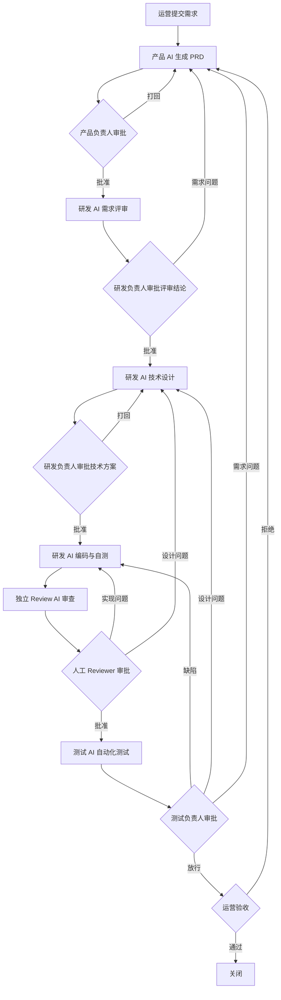

# AI 主执行研发工作流 SOP

## 1. 适用范围

适用于由运营、产品负责人、研发负责人、人工 Reviewer、专职测试和 AI 角色共同交付的软件需求。SOP 终点为测试放行和运营验收，不包含生产发布。

## 2. 角色责任

| 角色 | 执行责任 | 批准责任 |
|---|---|---|
| 运营需求方 | 描述业务问题、价值和期望；执行最终验收 | 原始需求与最终验收 |
| 产品 AI | 澄清需求、生成 PRD 和验收标准 | 无 |
| 产品负责人 | 审核 AI 的范围、规则和证据 | PRD 与需求变更 |
| 研发 AI | 需求评审、技术设计、编码、单测和自测 | 无 |
| 研发负责人 | 审核可行性、设计、风险和实现摘要 | 需求评审与技术方案 |
| Review AI | 独立审查代码、测试与需求一致性 | 无 |
| 人工 Reviewer | 审核 Review AI 的范围、证据和结论 | 代码合并 |
| 测试 AI | 设计用例、执行自动化测试、分析失败 | 无 |
| 测试负责人 | 审核覆盖、证据、缺陷等级和残余风险 | 测试放行 |

每个需求必须指定产品负责人、研发负责人、人工 Reviewer 和测试负责人。人工审批人可以拒绝 AI 建议，但必须记录理由。

## 3. 主流程

## 4. 阶段操作

### 4.1 运营提需

- 输入：需求申请单。
- 操作：运营确认业务问题、目标用户、价值、优先级和期望时间。
- 输出：带唯一 `REQ-ID` 的需求记录。
- 准出：必填字段齐全，运营确认内容真实。

### 4.2 产品 AI 与需求审批

- 输入：需求申请单及引用资料。
- 操作：产品 AI 澄清歧义，生成 PRD、非目标和可验证验收标准。
- 输出：PRD、问题清单、假设清单和需求追溯矩阵初版。
- 准出：产品负责人批准；未确认的关键业务规则为零。

### 4.3 研发 AI 需求评审

- 输入：已批准 PRD。
- 操作：分析可行性、依赖、数据、接口、兼容性、安全、工作拆分和可测试性。
- 输出：结构化评审报告及通过/有条件通过/打回建议。
- 准出：研发负责人批准；所有阻塞问题已关闭。

### 4.4 技术设计与审批

- 输入：已批准 PRD 和需求评审报告。
- 操作：研发 AI 生成架构、数据、接口、异常、兼容、回滚、可观测性和测试策略。
- 输出：技术设计、任务拆分、风险清单和追溯矩阵更新。
- 准出：研发负责人批准；高风险项有明确缓解与验证措施。

### 4.5 编码与自测

- 输入：批准的 PRD、技术设计和任务清单。
- 操作：研发 AI 编码，执行单元测试、静态检查、构建及功能自测。
- 输出：代码差异、提交引用、自测报告和已知限制。
- 准出：规定检查全部通过；验收标准均有实现和测试引用。

### 4.6 独立 AI Review 与人工审批

- 输入：只读代码差异、完整文件、批准材料和测试证据。
- 操作：Review AI 在独立上下文检查正确性、安全、性能、维护性及覆盖率。
- 输出：逐条发现、证据、严重度、建议和最终结论。
- 准出：阻塞问题为零，人工 Reviewer 批准合并。

### 4.7 测试 AI 与测试放行

- 输入：可测试构建、PRD、设计、变更、自测和 Review 记录。
- 操作：生成追溯用例，执行自动化测试，区分产品缺陷、脚本缺陷和环境问题。
- 输出：执行报告、证据、缺陷单、覆盖矩阵和放行建议。
- 准出：阻塞用例通过，无未处置严重缺陷，测试负责人批准。

### 4.8 运营验收与关闭

- 输入：测试放行结果和验收环境。
- 操作：运营按 PRD 验收标准验证业务结果。
- 输出：验收单。
- 准出：运营签字；追溯材料完整后关闭需求。

## 5. 异常和变更

- AI 置信度低于 0.80、关键输入缺失、批准材料相互冲突或发现高风险时，状态改为“已阻塞”并请求人工处理。
- 环境故障不得登记为产品缺陷；测试 AI 应保留日志并交测试负责人分类。
- 研发评审通过后的范围变化必须递增 PRD 版本，填写变更单，并重新评估设计、代码、测试和排期影响。
- 紧急需求可以缩短审批时限和文档篇幅，但不能跳过人工门禁、独立 Review、测试放行或运营验收。

## 6. 追溯规则

每项材料必须记录 `REQ-ID`、需求版本、`RUN-ID`、生成者、生成时间、引用输入版本和审批结果。验收标准使用 `AC-ID`，技术任务使用 `TASK-ID`，测试用例使用 `TC-ID`，缺陷使用 `BUG-ID`，并在追溯矩阵中建立关联。
